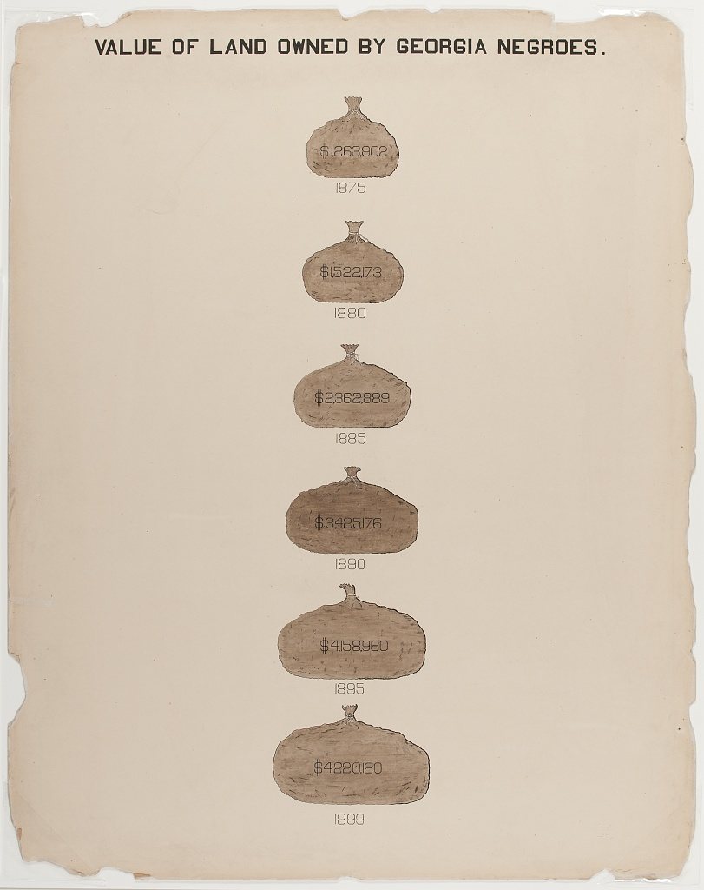
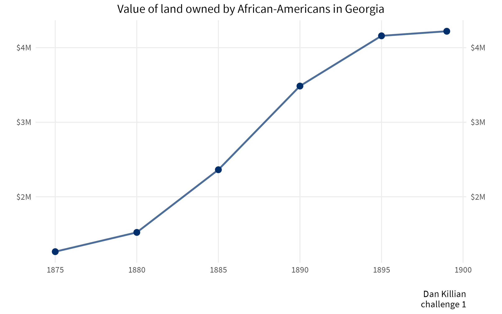
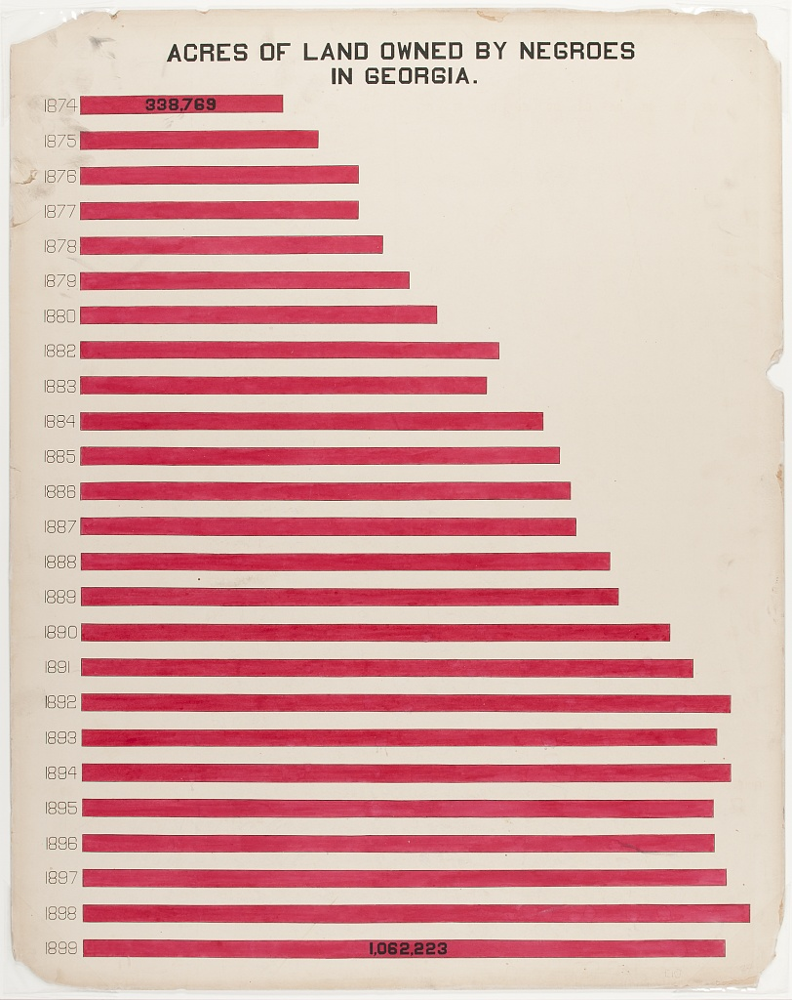
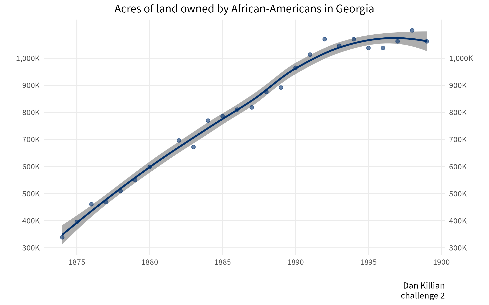

This repository showcases the entries into the 2025 Dubois Data Visualization Challenge

## Code with visualizations

[2025 Dubois Data Visualization Challenge](https://dkillian.github.io/dubois2025/Dubois%20Visualization%20Challenge%202025%20-%20Dan%20Killian.html)

## Visualizations only

### Week 1

### Week 2

